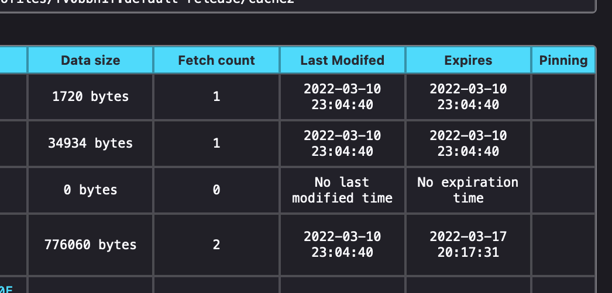

이미지와 같은 정적 리소스는 AWS Amplify에서 캐시를 설정해서 사이트를 최적화한다. 

1. Amplify 콘솔에서 성능 모드(Performance mode) 활성화
   - `앱설정` -> `일반` -> `브랜치` 섹션에서 설정할 수 있다. 

2. 커스텀 헤더로 리소스 별 캐시 기간을 설정한다.
   - `앱 설정` -> `사용자 지정헤더` 에서 설정할 수 있다.
   - `max-age`는 브라우저 캐싱 기간을 설정한다.
   - `s-maxage`는 CloudFront 캐싱 기간을 설정한다. (default 600초)
     - 성능 모드를 활성화하면 CloudFront 캐싱의 최소 TTL이 **10분(600초)**, 최대 TTL이 **1일(86,400초)**로 지정된다.
       s-maxage이 최대 TTL인 1일을 초과하는 경우 Amplify는 s-maxage를 최대 TTL인 1일로 지정한다.
   - 예제) next/image의 CloudFront 캐싱 기간을 1일(86,400초), 브라우저 캐싱 기간을 일주일(604,800초)로 설정하는  
     ```yaml
     customHeaders:
      - pattern: /_next/image*
        headers:
          - key: Cache-Control
            value: 'max-age=604800, s-maxage=86400' 
     ```

3. 캐시가 잘 설정되었는지 확인하는 방법
   - `s-maxage`에 설정한 cache는 CloudFront 캐싱 기간으로 http 응답 헤더의 age에 기록된다.
      
   - `max-age`에 설정한 cache는 브라우저를 통해 사용자의 로컬 디스크에 저장된다. <br />
      로컬 디스크의 캐시 적용을 확인하기 위해 파이어 폭스 브라우저를 활용한다. 
      - 파이어폭스 브라우저에서 [`about:cache?storage=disk`](about:cache?storage=disk)으로 이동한다.
        (파이어폭스 브라우저에서만 접속 가능하다.)
      - 하단 리스트에서 URL별로 캐시 된 리소스의 hit cound(`Fetch co와nt`)와 max-age를 기준으로 한 만료 일자(`Expires`)를 확인할 수 있다.<br />
        (여기서는 네 번째 리소스의 만료 일자가 3월 10일을 기준으로 한 일주일 후(3월 17일)로 지정된 것을 확인할 수 있다.)
       
        

#### 참고 자료
> Managing app performance<br />
> https://docs.aws.amazon.com/ko_kr/amplify/latest/userguide/ttl.html


> CloudFront에서 객체를 캐싱하는 시간 지정<br />
> https://docs.aws.amazon.com/ko_kr/AmazonCloudFront/latest/DeveloperGuide/Expiration.html


